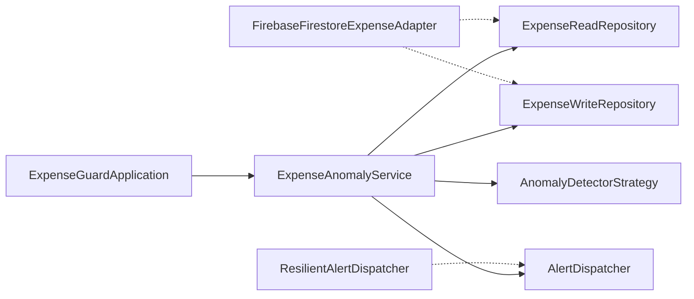

# Diagramas Arquiteturais

```mermaid
flowchart LR
    CLI[ExpenseGuardApplication] --> APP[ExpenseAnomalyService]
    APP --> READ[ExpenseReadRepository]
    APP --> WRITE[ExpenseWriteRepository]
    APP --> DISP[AlertDispatcher]
    APP --> STRAT[AnomalyDetectorStrategy]
    FB[FirebaseFirestoreExpenseAdapter] -.-> READ
    FB -.-> WRITE
    RES[ResilientAlertDispatcher] -.-> DISP
```
